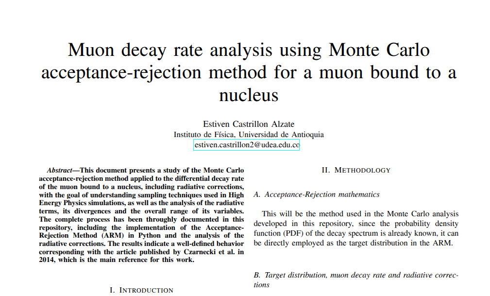

# Monte Carlo Simulation of Muon Decay (Michel Spectrum)

Monte Carlo implementation for simulating the electron energy spectrum from free muon
decay ($\mu^- \to e^- + \bar{\nu}_e + \nu_\mu$), including $\mathcal{O}(\alpha)$
radiative corrections, following the formalism of Czarnecki et al. (2014).

The core algorithm uses **acceptance-rejection sampling** to reproduce the differential
decay rate $d\Gamma/dx$ as a function of the normalized electron energy
$x = 2E_e/m_\mu$, and compares the resulting spectra with and without radiative
corrections.

Refer to the full report for the full information of the project:
*Click the preview to open the full PDF.*
 
[](docs/main.pdf)

---

## Physics Background

The normalized differential decay rate for muon decay is given by

$$
\frac{d\Gamma}{dx} = \frac{G_F^2 \, m_\mu^5}{192\pi^3} \, x^2
\left[ (6 - 4x) + \frac{\alpha}{\pi} f(x) \right], \qquad 0 < x \le 1
$$

where:

- $G_F$ is the Fermi coupling constant,
- $m_\mu$ is the muon mass,
- $\alpha$ is the fine-structure constant,
- $f(x)$ is the $\mathcal{O}(\alpha)$ radiative correction function, which involves
  the dilogarithm (Spence function) and logarithmic terms in $x$ and
  $\ln(m_\mu/m_e)$ (see further in the original paper).

The truncation of the perturbative expansion at $\mathcal{O}(\alpha)$ makes
$d\Gamma/dx$ unphysical (negative) for very small $x$. To avoid sampling from this
region, the simulation restricts the domain to $x \in [x_{\min}, x_{\max}]$, with
$x_{\min} \approx 4.77 \times 10^{-3}$ and $x_{\max} \approx 1 - \epsilon$ (to avoid
the kinematic endpoint singularity at $x = 1$, corresponding to
$E_{\max} = m_\mu/2 \approx 52.8$ MeV).

**Reference paper:**
> Czarnecki, A., Dowling, M., Garcia i Tormo, X., Marciano, W. J., & Szafron, R. (2014).
> *Michel decay spectrum for a muon bound to a nucleus*. Physical Review D, 90(9).
> https://doi.org/10.1103/PhysRevD.90.093002

---

## Project Structure

```text
monte-carlo-particle-decay/
├── .gitignore
├── LICENCE
├── README.md
├── environment.yml
├── pyproject.toml
├── requirements.txt
│
├── docs/                              # LaTeX report and figures
│   ├── figures/
│   │   └── Logo_UdeA.png
│   ├── main.tex
│   ├── main.pdf
│   └── references.bib
│
├── notebooks/
│   └── 01_analysis_of_results/
│       └── muon_decay_rate_analysis.ipynb   # Post-simulation analysis & validation
│
├── results/
│   ├── data/                          # Raw samples (.npy), ignored by git
│   └── plots/                         # Generated spectra (.png, .pdf)
│
├── scripts/
│   ├── run_analysis.py                # Entry point: runs both simulations
│   └── run_analysis.sh                # Shell wrapper
│
├── src/
│   └── python/
│       └── muonMonteCarlo.py          # Core `muonMonteCarlo` class
│
└── tests/
    ├── test.py
    └── testing_pdf_function.py
```

> **Note:** Raw simulation outputs (`results/data/*.npy`), generated plots
> (`results/plots/*.png`, `*.pdf`), and LaTeX build artifacts are excluded from
> version control via `.gitignore`. They are regenerated automatically by running
> the analysis scripts.

---

## Installation

### 1. Clone the repository
```bash
git clone https://github.com/<your-username>/monte-carlo-particle-decay.git
cd monte-carlo-particle-decay
```

### 2. Set up the environment

**Venv + pip**
```bash
python3.12 -m venv venv
source venv/bin/activate          # On Windows: venv\Scripts\activate
pip install -r requirements.txt
```

Key dependencies: `numpy`, `scipy`, `matplotlib`, `scienceplots`, `tqdm`, `particle`.

---

## Usage

### Run the full simulation (with and without radiative corrections)
```bash
python scripts/run_analysis.py
```
or, using the shell wrapper:
```bash
bash scripts/run_analysis.sh
```

This will:
1. Sample $10^8$ electron energies from $d\Gamma/dx$ via acceptance–rejection
   sampling (once with radiative corrections included, once without).
2. Save the raw normalized ($x$) and physical ($E_e$, in MeV) samples to
   `results/data/*.npy`.
3. Generate publication-quality histograms of the electron energy spectrum in
   `results/plots/`.

### Explore and validate results
```bash
jupyter notebook notebooks/01_analysis_of_results/muon_decay_rate_analysis.ipynb
```
The notebook contains comparisons between the radiative and non-radiative spectra,
overlays of the theoretical $d\Gamma/dx$ curve, and boundary-behavior diagnostics
near $x \to 0^+$ and $x \to 1^-$.

### Basic API example
```python
from src.python.muonMonteCarlo import muonMonteCarlo

mc = muonMonteCarlo(n_events=1_000_000, include_radiative=True)
mc.simulation(x_min=4.770585e-03, x_max=0.99999)
mc.graphical_analysis(
    title="Muon decay electron energy spectrum",
    xtitle="Electron energy $E_e$ [MeV]",
    ytitle="Number of events"
)
```

---

## Testing
```bash
pytest tests/
```

---

## Documentation
Full derivation, methodology, and results discussion are available in the LaTeX
report at `docs/main.pdf` (source in `docs/main.tex`).

---

## License
Distributed under the terms specified in [`LICENCE`](LICENCE).

## Author
Developed as part of a my High Energy Physics independent projects to enroll in particle physics research as an undergraduate student at the Universidad de Antioquia in Colombia.